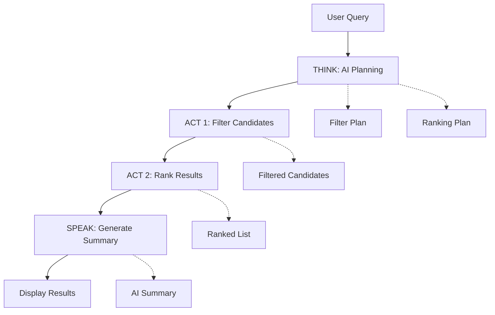

# 🎯 ATS Lite

**ATS Lite** is an intelligent Applicant Tracking System powered by AI that allows recruiters to query candidate datasets using natural language. Built with Next.js and featuring a transparent **MCP (Model Context Protocol)** loop, it provides real-time AI-driven candidate filtering, ranking, and analysis.

## ✨ Features

### 🤖 **AI-Powered Candidate Search**

- Natural language querying of candidate databases
- Intelligent filtering and ranking based on complex criteria
- Real-time AI reasoning with transparent thinking process

### 💬 **Interactive Chat Interface**

- ChatGPT-like streaming responses
- Smart suggestions for common recruiter queries
- Real-time message processing with visual feedback

### 📊 **Transparent MCP Loop**

- **THINK**: AI analyzes your query and creates a plan
- **ACT 1**: Filter candidates based on criteria
- **ACT 2**: Rank candidates by relevance
- **SPEAK**: Generate human-friendly summaries

### 🎨 **Modern UI/UX**

- Clean, responsive design with dark/light theme support
- Animated transitions powered by Framer Motion
- Collapsible sidebar with chat history
- Detailed candidate profile sheets

### 📈 **Advanced Analytics**

- Candidate statistics and insights
- Skills distribution analysis
- Experience level breakdowns
- Location and availability metrics

## 🚀 Quick Start

### Prerequisites

- **Node.js** 18+ or **Bun** (recommended)
- **OpenAI API Key**

### Installation

1. **Clone the repository**

   ```bash
   git clone <your-repo-url>
   cd ats-lite
   ```

2. **Install dependencies**

   ```bash
   # Using Bun (recommended)
   bun install

   # Or using pnpm
   pnpm install
   ```

3. **Set up environment variables**

   ```bash
   cp .env.example .env.local
   ```

   Add your OpenAI API key:

   ```env
   OPENAI_API_KEY=your_openai_api_key_here
   ```

4. **Run the development server**

   ```bash
   # Using Bun
   bun dev

   # Or using npm
   pnpm run dev
   ```

5. **Open your browser**
   Navigate to [http://localhost:3000](http://localhost:3000)

## 💡 Usage Examples

### Natural Language Queries

**Find experienced developers:**

```javascript
'Frontend engineers, sort by experience, most experience first'
```

**Filter by location and salary:**

```javascript
'Remote Python developers with salary below 150k'
```

**Complex criteria:**

```javascript
'Data engineers in Berlin with less than 2 weeks notice'
```

**Specific requirements:**

```javascript
'DevOps Engineer in India, most experience first'
```

### Chat Interface

1. **Start a conversation** by typing your query
2. **Watch the MCP loop** unfold in real-time:
   - See the AI's thinking process
   - View filtering and ranking steps
   - Get detailed candidate results
3. **Click on candidates** to view detailed profiles
4. **Use suggestions** for common queries

## 🏗️ Architecture

### Tech Stack

| Category             | Technology              |
| -------------------- | ----------------------- |
| **Framework**        | Next.js 15 (App Router) |
| **Language**         | TypeScript              |
| **Styling**          | Tailwind CSS            |
| **Animations**       | Framer Motion           |
| **State Management** | Zustand                 |
| **AI Integration**   | OpenAI GPT-4o-mini      |
| **CSV Processing**   | PapaParse               |
| **UI Components**    | Radix UI                |
| **Testing**          | Jest + Testing Library  |

### MCP Loop Architecture



### Project Structure

```javascript
ats-lite/
├── app/                      # Next.js App Router
│   ├── api/                  # API routes
│   │   ├── _tools/          # Shared API utilities
│   │   ├── csv/             # CSV processing endpoint
│   │   └── llm/             # LLM integration endpoint
│   ├── layout.tsx           # Root layout
│   └── page.tsx             # Main chat interface
├── components/              # React components
│   ├── chat/               # Chat interface components
│   ├── candidate/          # Candidate-related components
│   ├── common/             # Shared components
│   └── ui/                 # Base UI components
├── hooks/                  # Custom React hooks
├── lib/                    # Utility libraries
├── store/                  # Zustand state management
├── types/                  # TypeScript type definitions
├── constants/              # Configuration constants
└── public/                 # Static assets
    └── candidates.csv      # Sample candidate data
```

## 🔧 Configuration

### App Configuration

Key configurations are centralized in `constants/app-config.ts`:

```typescript
// LLM Settings
LLM_CONFIG = {
  DEFAULT_MODEL: 'gpt-4o-mini',
  TEMPERATURE: 0.1,
  MAX_TOKENS: 1000,
}

// Candidate Processing
CANDIDATE_CONFIG = {
  TOP_SKILLS_COUNT: 5,
  TOP_CANDIDATES_COUNT: 5,
  SKILLS_DISPLAY_COUNT: 5,
}
```

### Environment Variables

```env
# Required
OPENAI_API_KEY=your_openai_api_key_here

# Optional
NEXT_PUBLIC_APP_NAME=ATS Lite
NEXT_PUBLIC_APP_DESCRIPTION=AI Agents for ATS
```

## 🧪 Testing

### Run Tests

```bash
# Run all tests
bun test

# Watch mode
bun test --watch

# Coverage report
bun test --coverage
```

### Test Structure

```bash
__tests__/
├── mcp-tools.test.ts       # MCP workflow tests
└── components/             # Component tests
```

## 📊 Data Format

### Candidate CSV Structure

The system expects candidates data in CSV format with these columns:

```csv
id,full_name,title,location,timezone,years_experience,skills,languages,education_level,degree_major,availability_weeks,willing_to_relocate,work_preference,notice_period_weeks,desired_salary_usd,open_to_contract,remote_experience_years,visa_status,citizenships,summary,tags,last_active,linkedin_url
```

### Candidate Type Definition

```typescript
type Candidate = {
  id: string
  full_name: string
  title: string
  location: string
  years_experience: number
  skills: string[]
  desired_salary_usd: number
  // ... and more fields
}
```

## 🎨 UI Components

### Key Components

- **ChatInput**: Message input with keyboard shortcuts
- **ChatMessages**: Streaming message display
- **ThinkingTimeline**: Visual MCP loop progress
- **CandidateSheet**: Detailed candidate profiles
- **AppSidebar**: Navigation and chat history

### Theme Support

- Light/Dark mode toggle
- System theme detection
- Persistent theme preferences

## 🔌 API Endpoints

### `/api/llm`

- **Method**: POST
- **Purpose**: Handle LLM interactions
- **Body**: `{ messages: ChatMessage[], model: string }`

### `/api/csv`

- **Method**: GET
- **Purpose**: Fetch and parse candidate data
- **Returns**: Parsed candidate array

## 🚢 Deployment

### Vercel

1. **Connect your repository** to Vercel
2. **Add environment variables** in Vercel dashboard
3. **Deploy** automatically on push to main

## 🛠️ Development

### Available Scripts

```bash
bun dev          # Start development server
bun build        # Build for production
bun start        # Start production server
bun lint         # Run ESLint
bun test         # Run tests
bun test:watch   # Run tests in watch mode
```

### Code Quality

- **ESLint** for code linting
- **Prettier** for code formatting
- **TypeScript** for type safety
- **Jest** for testing

## 🤝 Contributing

1. **Fork** the repository
2. **Create** a feature branch (`git checkout -b feature/amazing-feature`)
3. **Commit** your changes (`git commit -m 'Add amazing feature'`)
4. **Push** to the branch (`git push origin feature/amazing-feature`)
5. **Open** a Pull Request

## 🐛 Troubleshooting

### OpenAI API Key Not Working

- Verify your API key in `.env.local`
- Check API key permissions and billing status

### CSV Not Loading

- Ensure `candidates.csv` exists in the `public/` directory
- Verify CSV format matches expected columns

### Build Errors

- Clear `.next` directory: `rm -rf .next`
- Reinstall dependencies: `bun install`

### Debug Mode

Enable debug logging by setting:

```env
NODE_ENV=development
```

---

### Built with ❤️ for modern recruitment workflows
